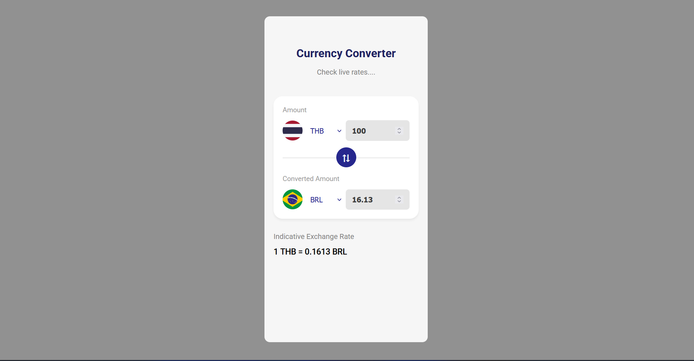

# 💱 Currency Converter

A clean, real-time currency converter built with **React + Vite**. Fetches live exchange rates and displays country flags for a polished UI.


---

## ✨ Features

- 🔄 **Live exchange rates** via the [fawazahmed0 Currency API](https://github.com/fawazahmed0/exchange-api)
- 🏳️ **Country flags** via [flagcdn.com](https://flagcdn.com) with a currency-to-country mapping
- ⇅ **Swap currencies** with a single click
- 📉 **Indicative exchange rate** displayed in the footer
- ⚛️ Fully controlled React components with clean state management

---

## 🖥️ Demo

> Enter an amount, pick your source and target currency, and see the converted value instantly.

---

## Screenshots


---


## 🚀 Getting Started

### Prerequisites

- [Node.js](https://nodejs.org/) v18+
- npm or yarn

### Installation

```bash
# 1. Clone the repository
git clone https://github.com/ujjawal149-droid/currency-converter.git
cd currency-converter

# 2. Install dependencies
npm install

# 3. Start the development server
npm run dev
```

Then open [http://localhost:5173](http://localhost:5173) in your browser.

---

## 🗂️ Project Structure

```
src/
├── components/
│   ├── CurrencyInput.jsx      # Reusable input with flag + currency selector
│   └── CurrencyInput.css
├── App.jsx                    # Main app logic & state
├── App.css
└── main.jsx
```

---

## 🔌 API Reference

This project uses two free, no-auth endpoints:

| Endpoint | Purpose |
|----------|---------|
| `GET /v1/currencies.json` | Fetch the full list of supported currencies |
| `GET /v1/currencies/{code}.json` | Fetch exchange rates for a specific currency |

Base URL: `https://cdn.jsdelivr.net/npm/@fawazahmed0/currency-api@latest`

---

## 🛠️ Built With

- [React](https://react.dev/) — UI library
- [Vite](https://vitejs.dev/) — Build tool
- [fawazahmed0/exchange-api](https://github.com/fawazahmed0/exchange-api) — Free currency exchange rates
- [flagcdn.com](https://flagcdn.com) — Country flag images

---

## 📦 Build for Production

```bash
npm run build
```

Output will be in the `dist/` folder, ready to deploy to Vercel, Netlify, GitHub Pages, etc.

---

## 🤝 Contributing

Contributions are welcome! Feel free to open an issue or submit a pull request.

1. Fork the repository
2. Create your feature branch: `git checkout -b feature/my-feature`
3. Commit your changes: `git commit -m 'Add my feature'`
4. Push to the branch: `git push origin feature/my-feature`
5. Open a pull request

---

## 📄 License

This project is licensed under the [MIT License](LICENSE).